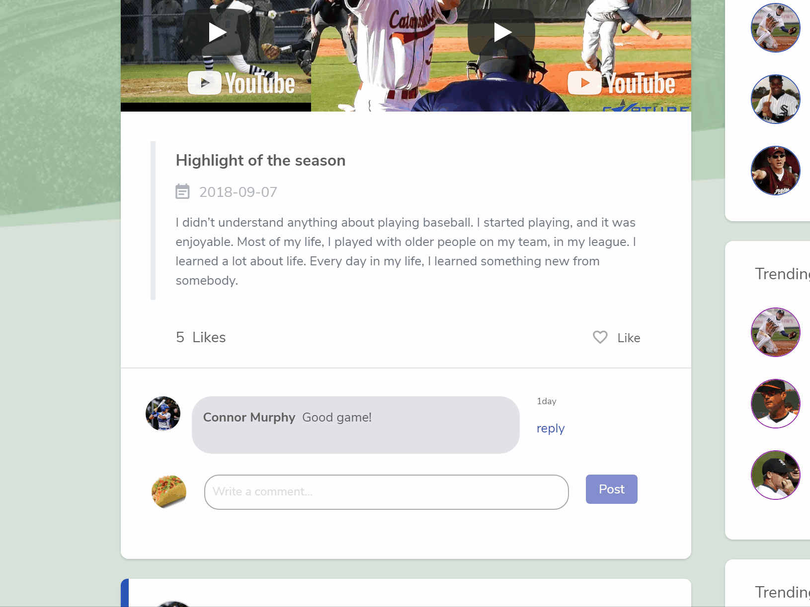

# Social-Media-Comment-Thread

This is a comment thread that provides a recursive social media style comment system  to any post.

All state and functions are held in the top level component <CommentsContainer/>

An HTTP request is made to the server to retrieve comment data.

Comments for a post are stored in an array of objects in state.
        {
          postId: post.ParentPost,
          commentId: post.Id,
          parentComment: post.ParentComment,
          user: post.UserId,
          username: post.FirstName + " " + post.LastName,
          userAvatar: post.AvatarUrl,
          dateCreated: timeStamp,
          comment: post.Comment
        };
        
<CommentReplies/> are mapped recursively as child components of root level comments in <CommentThread/>

